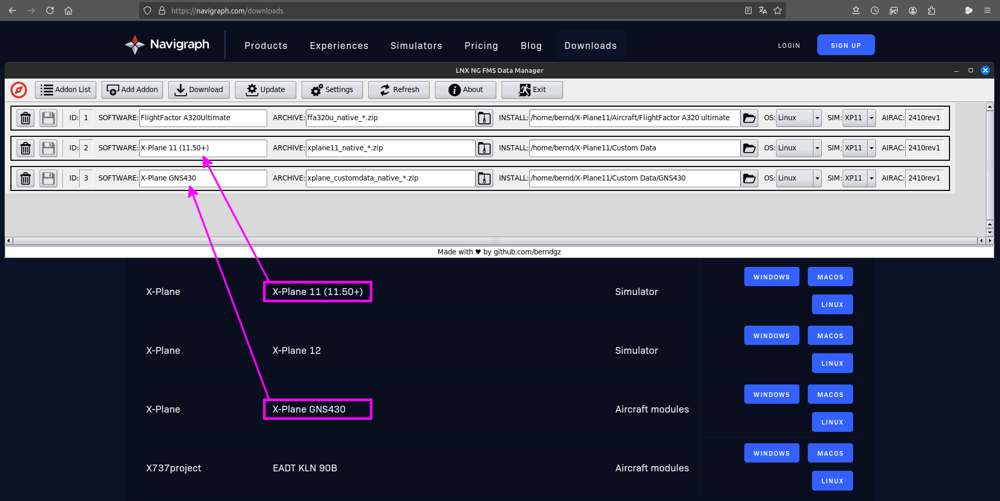
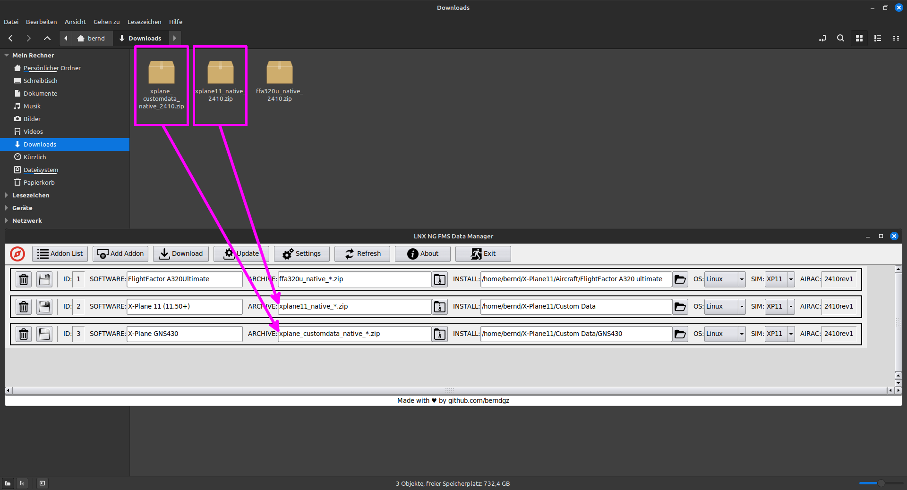

# lnxngfmsdm


## LNX NG FMS Data Manager  [](https://www.buymeacoffee.com/berndgz) [](LICENSE)

### Description:

[Navigraph Downloads](https://navigraph.com/downloads) rarely support Linux, and there is no support at all for the `FMS Data Manager` and `Simlink`.

For Navigraph, the number of Linux users does not justify this investment and the company only provides [Manual Downloads](https://navigraph.com/downloads) for distribution of `Navigation Data`.

Updating the `Navigation Data` is a process that repeats every 28 days and can be quite annoying if you have to do it manually.

This situation was the reason for me to develop a [__Linux NG FMS Data Manager__](https://github.com/berndgz/lnxngfmsdm) application to manage the AIRAC Cycle `Navigation Data` from Navigraph on __Linux__.

### Addon update process:
```text
download archive file > delete old files > install new files > backup archive file
|                   |   |                                                        |
|---[ Download ]----|   |-----------------------[ Update ]-----------------------|
```

### Requirements:

* __Navigraph Data only__ or __Navigraph Unlimited Subscription__ to get access to the `Navigation Data`.
* __Google Chrome Webbrowser__ to use the automated `Download` feature via the included Selenium WebDriver.

### Usage:

1. Download the [__lnxngfmsdm-x86_64.AppImage__](https://github.com/berndgz/lnxngfmsdm/releases) file and make it executable and run it ([AppImage Quickstart](https://docs.appimage.org/introduction/quickstart.html)).
2. `Add Addon` to the `Addon List` which you need from the Navigraph [Manual Downloads](https://navigraph.com/downloads) and enter the corresponding Addon data. Please refer to the related screenshots and don't forget to save.
3. Enter LOGIN credentials for the [Navigraph Downloads](https://navigraph.com/downloads) website under `Settings` to use the automated `Download` feature and don't forget to save.
4. Press the `Download` button and wait until the process has finished. __Do not click anywhere else!!!__
5. Press the `Update` button and wait until the process has finished.
6. Done, all addons in the `Addon List` have been updated to the current displayed version and the downloads are backupd.

### Known Issues:

* __*Issue:*__ If Navigraph changes something relevant on its website, the automated `Download` may fail due to HTML DOM tree elements not being found from the Selenium WebDriver.
* __*Solution:*__ Manually download the addon archive file from the [Navigraph Downloads](https://navigraph.com/downloads) website and proceed with the `Update` in [Linux NG FMS Data Manager](https://github.com/berndgz/lnxngfmsdm).

### Q & A:

* __*Q:*__ I want to factory reset the [Linux NG FMS Data Manager](https://github.com/berndgz/lnxngfmsdm), how can I do this?
* __*A:*__ Close the app and delete the `~/.lnxngfmsdm.db` file in your personal folder, and the [Linux NG FMS Data Manager](https://github.com/berndgz/lnxngfmsdm) will start fresh and clean.

### Screenshots:

[](screenshots/lnxngfmsdm_software.png)

[](screenshots/lnxngfmsdm_archive.png)

### Note:

This app is not intended to be a full feature clone of the available Windows and macOS versions of Navigraph, but rather follows the Unix philosophy *"a program should do one thing and do it well"*, and this is a convenient update of the navigation data from Navigraph on Linux. I have put a lot of time and heart into this app and hope that the community enjoys it as much as I do.

### Donate:

If you find this app helpful and want to support my work, you can ...

[](https://www.buymeacoffee.com/berndgz)

[](https://www.buymeacoffee.com/berndgz)
